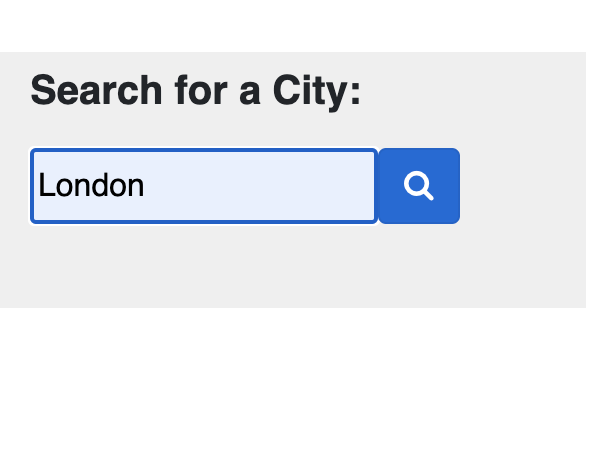
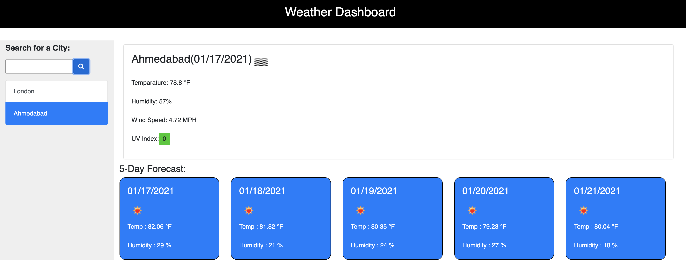
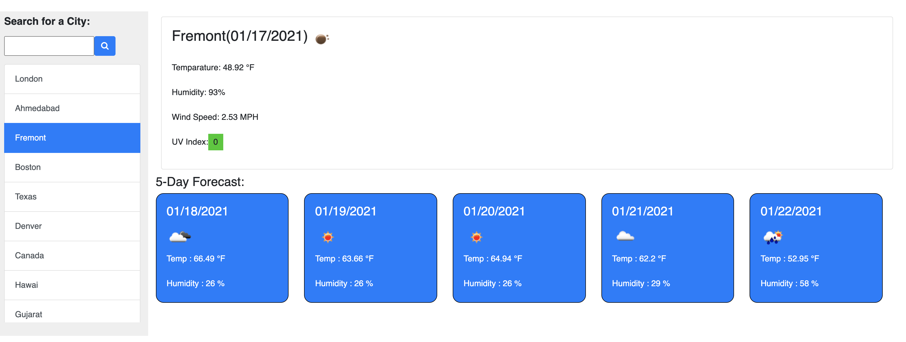

# WeatherDashboard
Weather Dashboard shows current weather data and forecast weather data for 5 days for search City/State/Country. It is developed using third party server side api called https://openweathermap.org/api

Weather Dashboard mainly shows Temparature , Humidity , WindSpeed and UV index for selected city. UltraViolet Index color indicate whether the weather conditions are favorable(green), moderate(yellow), or severe(red)

Search Cities are maintained in LocalStorage and also displayed in list for User for easy access.

GitHub Detail -

Weather Dashboard project is uploaded in GitHub.

For clone the project use below options or you can download Zip file.

SSH "git@github.com:bhumisha/WeatherDashboard.git" HTTPS :https://github.com/bhumisha/WeatherDashboard.git

Project Source code : https://github.com/bhumisha/WeatherDashboard

You can view weather for searched city using below link https://bhumisha.github.io/WeatherDashboard/

This project codebase is written in HTML,CSS and JQuery and also we have used moment.js,JQuery and bootstrap third party libraries and server side api calls. Main logic is written in JQuery. Js file contains DOM manipulation, conditional statements / loop statement / validations and functions for modularised code.
Fetch APi is used to call server side api. LocalStorage is also used to store search cities.

To get current and Forecast weather, two server side api calls have beem made from  from https://openweathermap.org/api 
Current Weather Data API
One Call API

The following screen demonstrates the application functionality: 
Search Panel

Searched city store to localhost and show active in list

See weather from listed city

